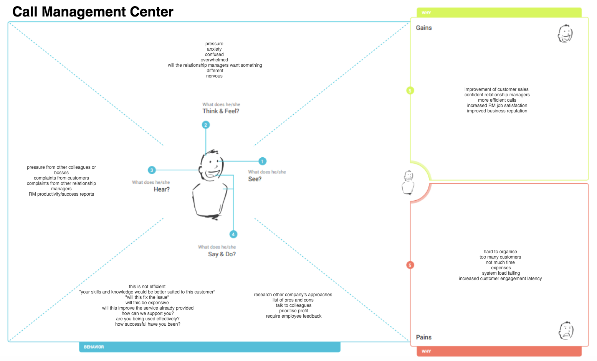
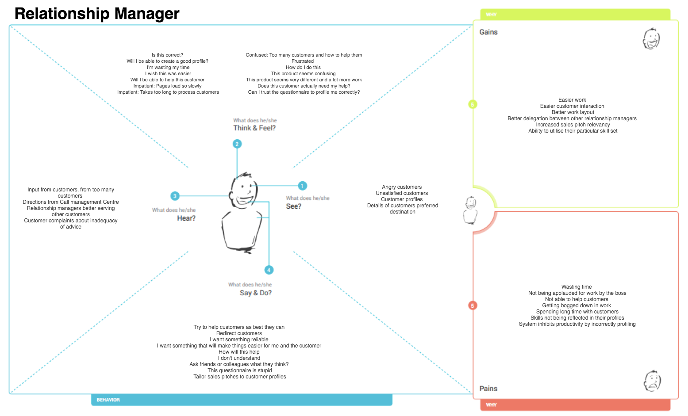
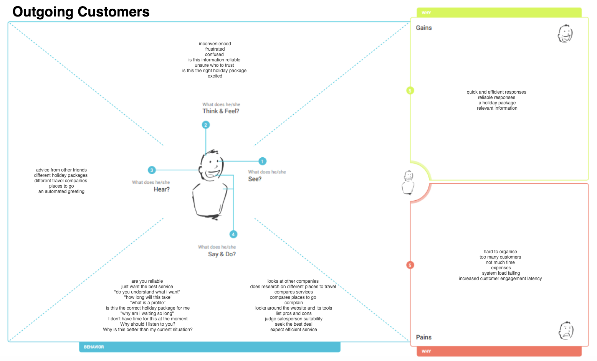
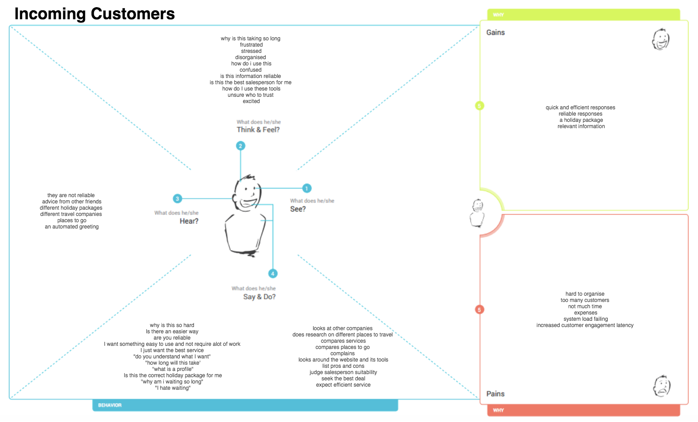

# Information Systems Development Project 

Video presentation hyperlink: https://www.youtube.com/watch?v=0FaoOdVmQfs&feature=youtu.be

## Objectives of the Project 

The objectives of this project is to improve the processes that are currently implemented at the travel company's Call Management Centre (CMC). The information gathered through reading the document specification of the travel company  has highlighted the changes that our user would like to see integrated into the new Information System (IS). It is understood that the current model is outdated and needs to be more streamlined in order to achieve maximum efficiency and effectivness when making sales. 

## Design thinking approach 

### Problem definition 

Currently, Relationship managers communicate with customers through the in-house call management centre, arbitrarily directsing both inbound and outbound customers to relationship managers, with little to no experince in the customers holiday of interest, resulting in unsatisfied customers,long waiting periods, unreliable and inefficient services, which has lead to loss of sales and reduced the ability to establish loyal customers to the company. The following report outlines the proposed new Information System (IS), which will integrate new features and processes to facillitate a better interaction between key stakeholders. 

### Stakeholders 

Our key stakeholders for this new operating system include: 

-	Inbound customer callers
-	Outbound customer callers
-	Relationship manager (RM) 
-	Call Management Centre (CMC)

We have empathised with each of these customises by creating empathy maps for each of these key stakeholders. This is featured in the section below.

### Empathy Maps 

  <kbd>
  
  </kbd>

  <kbd>
  
</kbd>
  

  

  <kbd>
  
    </kbd>

  <kbd>
  
  </kbd>

### Point of View Statements

The following are the key Point of View (POV) statements which were identified through analysing the project specification and the empathy maps. 

| ID |  POV Statement |
| ----- | --- |
| POV #1| A customer should be connected with the best suited relationship manager that has knowledge and experience with their holiday pakcage of interest. The more reliable the information and detail the relationship manager can provide will lead to improved customer relationships and increase likelihood of a sale purchase. |
| POV #2| A customer who is interested in holiday package needs a way to communicate efficiently with a well-informed relationship manager on the holiday package that interest them the most because this will help in their decision to purchase a package. |
| POV #3| A relationship manager needs a way to make outbound calls and receive inbound calls, whilst also delivering efficient and well-informed conversations about potential holiday packages. They need to be matched with callers that are express interest in their field of experience so that they provide reliable information to the customer. |
| POV #4| The Call Management Centre must be able to recieve calls from inbound customers and then allocate them to their suitable relationship mangager. In addition to this, they need to be able to source outbound callers, and then provide these details to specific relationship managers who are then tasked to conduct the outbound calls. |

The POV statements served as tool to optimize the work process, to benefit the companys understanding of end users and to launch our brainstorm of How Might We (HMW) statements (as seen in the following section). 

### How Might We Statements 

The following table shows all of the How Might We Statements (HMW) built from the POV statements. 

| ID | How Might We... | 
| --- | --- |
| HMW #1 | reduce the time that the customer do need to hang up  |
| HMW #2 | improve the relationship between staffs and customers  |
| HMW #3 | improve the quality in the conversation betweem customers and RMs  |
| HMW #4 | understand which products that customers want to know about  |
| HMW #5 |enable the relationship manager to make outbound calls   |
| HMW #6 | enable the relationship manager to make and receive well informed conversations with potential buyers  |
| HMW #7 | increase the amount of calls completed by the relationship manager  |
| HMW #8 | decrease the waiting period between each inbound customer  |
| HMW #9 | speed up the time the relationship manager spends with its clients |
| HMW #10 | assist the relationship manager in developing genuine relationships between customers and business |
| HMW #11 | assist the customer in communicating their interests  |
| HMW #12 | provide a suitable relationship manager to customers |
| HMW #13 | increase the time taken to make a purchase with a customer |
| HMW #14 |  identify which customers previously used the service before |
| HMW #15 | improve the staff skill so they can serve the new customer with the best they can |
| HMW #16 | match the RM with the buyer that they have talked before |
| HMW #17 | receive the feedback from the customer that can improve the quality of the service| 

### Reflection

At this stage of the project, we have as a team, empathised with our key stakeholders, and defined the gaps in the current operating system, to which solutions will be provided in upcoming work products.  To begin with, we generated empathy maps for each of our key stakeholders: 

-	Inbound customer callers
-	Outbound customer callers
-	Relationship manager (RM) 
-	Call Management Centre (CMC)

These are the stakeholders most affected by the implementation of the new system. We have analysed their thoughts and behaviours, as well as their key pains and gains. We then brainstormed POV Statements and converted them into HMW Statements to reframe our insights into the best solutions for the new information system. 

Moving forward, we will use the product backlog generated from these brainstorming exercises to kickstart our progression into the ideation phase. During this stage, we will develop work products such as use case diagrams and activity diagrams to generate a systematic solution for the operating system. 

One of the biggest challenges so far is understanding the scope of the project and how extensive the improvement in the information system will be for the travel company. Whether or not the  new operating system will extend to customers having access to the system online is still a consideration we are yet to take onboard. 

Currently, our assumptions are based on our initial readings of the project outline. This is what we assume about the existing and new system, however, these are subject to change and/or  are expected to be resolved later in the project.
- The relationship manager can create a customer profile using the profiler tool. 
- Relationship managers can edit their profile
- relationship managers can make a purchase on behalf of the customer 
- achieiving a sale involves a purchase by the customer
- new customers will be automatically be allocated low priority 
- we have enough human resources to complete the work during a short time period
- do not have any dificulties during the working process

### Ideation 

Using our understanding of the stakeholders and their, gained from brainstomring of empathy map, POV statements and HMW statements, we were able to formulate user stories for each. These user stories then formed the product backlog for our project. Eventually, they were incoporated into work products.

#### Product Backlog/ User Stories 

| ID  | User Story | Priority |
| ------------- | ------------- | ---------- |
| US #1 | As a relationship manager, i want to record any sales made, so that i can improve my skill score | High | 
| US #2 | As a relationship manager, i want to be able to input customers payment details on there behalf, so that i can make a payment for a holiday package | High | 
| US #3 | As a relationship manager, i want to be able to create, edit and delete my profile, so that i can keep customers updated on my skill, experiences and knowledge.  | High | 
| US #4 | As a relationship manager, i want to retrieve the target list, so that i can make calls to outbound customers | High | 
| US #5 | As a relationship manager, i want to view customers details and potential holiday packages, so that i can deliver a more specific and tailored service  | High | 
| US #6 | As a relationship manager, i want to servce customers with the highest scores, so that i can achieve a sale efficiently  | High | 
| US #7 | As the Call Management Centre, i want to direct customers to an Interactive Voice Response when no relationship manager is available, so that we can gather feedback and information from the customer  | High |
| US #8 | As the Call Management Centre, i want to be able to create, view and delete customer and relationship manager profiles, so that i keep information about end users updated | High |
| US #9 | As an inbound customer, i want to connect to the RMs that serve me before so that i can work with them easily | Medium | 
| US #10 | As an inbound customer, i want to be directed to a relationship manager who is familliar with a particular holiday package, so that i can obtain reliable information about the place | Medium | 
| US #11 | As a an inbound customer, i want to view the purchases made through the travel company, so i can review the holiday packages  | Medium |
| US #12 | As an outbound customer, i want to see the feedback about the company before i made the purchase so that i can believe that i will not be scammed  | Medium |
| US #13 | As Travel company, i want to save the customer's feedbacks so that we can improve the negative aspects of the company | Medium |
| US #14 | As the Call Management Centre, i want generate scores for relationship managers and customers, so that they can be matched based off this criteria | Medium |
| US #15 | As an inbound customer, i want to view different holiday packages, so that i can develop more information about each place  |Low | 
| US #16 | As an inbound customer, i want to view the prices of holiday packages in order of lowest to highest fares, so that i can choose the holiday packages efficiently.| Low | 
| US #17 | As a relationship manager, i want my special discounts rates to be displayed to me so that i can offer my clients competitive rates  | Low | 

All these user stories formed the foundation of our solution to a new and improved Information System (IS) for the travel company. In the following sections, we explore the detailed models and descriptions of the IS process. 

## Prototyping and models - Workproducts, models and descriptions

After identifying the key user stories, we integrated these use stories as use cases into our work products. The following diagrams are illustrated below: 
- Use Case Diagram 
- Class Diagram 
- Activity Diagram 
- Collaborative Diagram 

### Use case Diagrams

At the beginning of the project, we developed an intial use case diagram. At first, it was from the customers perspective with the following use cases: 
- give details 
- choose travel package 
- ask about discounts
- make payment 

However, after deliberation and constant review of the diagram and it's use cases, we developed a more in-depth model of the interactions between users and the system. We largely focused on the use cases related to the Relationship manager as they were a primary actor, using the system to create a sale *for* the customer. In addition to this, we also decided to split the customer into Inbound Customers and Outbound Customers. This provided a clearer representation of the interactions that occur between the actors and their use cases. 

***For Inbound Customers:***

  

In this diagram, the primary actors are the call management centre, the relationship manager and the interactive voice response. They all interact with the system directly to achive a sale. Whilst, the customer is secondary to all the processes and help in assisting the primary actors use of the system. 

It was important to elaborate on the first iteration of the use case diagram as there were many more use cases to consider. incremental development of the use case diagram led to many extend and include relationships being added and removed in the IS process and ultimately led to this final work product (as seen above).

***For Outbound Customers:***

  

### Activity Diagrams

Similarly, with the development of the activity diagram, we began with initial activity diagram, which then were later expanded to include greater depth on the systems interactions and functionality. 

***For Inbound Customers:***

  

***For Outbound Customers:***

  

### Class Diagram

The following class diagram shows the systems classes, their attributes, operations adn the relationsips among classes and objects.

  

### Collaborative Diagrams

The following diagrams focus on the roles of the objects as they interact with the system. The directional links indicate the communication between objects and are labelled using messages. 

Collaborative diagram for: ***Making a booking via a Relationship Manager***

  <kbd>
  
  </kbd>

Collaborative diagram for: ***Matching a Customer to an appropriate Relationship Manager***

   <kbd>
  
   </kbd>

Collaborative diagram for: ***Generating a Target List***

   <kbd>
  
   </kbd>

## Scrum activities 

For this project, we used the Scrum development process to help facilitate teamwork, accountability, and iterative progress towards our defined goal for the new Information System. We used Git Hub as it seamlessly integrates transparency throughout the development of the project, as each team member was able to openly view, edit and provide feedback on each commit to the repository. 

To begin with, we used user stories to develop our product backlog, as well as any arbitrary tasks which needed to be completed prior to that. For our first sprint, we generated a backlog, which contained the most important user stories, as that would form the foundations of our work products. These were labelled as ‘Important’ in the ‘Issues’ section of Git Hub. For example some user stories which were selected from the Product backlog for the initial sprint related to creating an existing customer profile and a corresponding RM profile. We used a Kanban board to help visualise and manage the issues which needed to be integrated in the sprint. We divided the board into ‘To do”, “In progress” and “Done”. Once a user story has been fully accounted for, only then was it allowed to be added to “Done”. This procedure was supportive of continuous delivery, enabling work products to be released and completed frequently to the Git Hub repository. 

In relation to Scrum events implemented into the project, we took the basic format of many of the scrum meetings and tailored it to the context of this assignment (i.e. student commitments, the project didn’t require code development and inability for face to face communication). As a result, Scrum meetings were conducted primarily during tutorials and were instigated simultaneously during the class. During weekly tutorials we completed sprint planning meetings which consisted of the following: 
-	We discussed the tasks that were completed in the prior week and tasks that need to be completed for the next week. 
-	We conducted sprint review meetings by analysing the backlog not completed in the prior sprint and adding these features into our next sprint.  
-	We conducted sprint review retrospective meeting by reviewing processes that worked well, what created the most problems and discussed solutions rectify problems for future sprints. 

Throughout the week we maintained constant communication via social media platforms, emails, and weekly zoom calls (outside of class hours). This allowed for open and honest communication between team members, which ensured greater transparency in the project. 

## Competitive advantages and possible effects if the project fails 

***Competitive Advantages*** 

The proposed call management system has the potential to contribute significantly to the economic situation of the Travel company. Their success hinges on its employees’ ability to provide meaningful and efficient interactions with potential and/or existing customers in order to greater facilitate the purchase of holiday packages. In the current operational blueprint, this interaction is relatively unregulated, and unoptimised, that is, Relationship Managers (RM) are  tasked with seeking out Customers and providing them with arbitrary holiday packages. The new system, as illustrated in the report, would manage the pairing of such Customers and RM based on both survey results and demographic profiling, features which will obviously boost productivity and efficiency of end users. As Customers target list are generated and optimally allocated, RM's have more time dedicated towards helping Customers find the right holiday package, thus increasing the likelihood of a sale. Moreover, they can be confident that their technique is suited to their candidates, both of which would contribute to relationship manager satisfaction and confidence. Call Centres with low employee satisfaction are more conducive to stress and may generate higher employee turnover, which can be corrosive of relationships between RM's and their existing Customers. It is important for Customers to be assured they are communicating with an RM that possesses the necessary skill, knowledge and experience related to holiday package of interest. From the Customer’s perspective, they want to feel like their RM understands their requirements, which would be assured through the survey and the behaviour of their assigned RM. Thus, a more structured exchange between Customers and RMs will lead to greater customer loyalty, greater maintenance of customer records, reduction in waiting time and skills wastage, ultimately leading to a greater sales potential for the Travel Company. 

***Impact of System Failure***

Hypothetically, if the system implementation fails, the time and resources spent on training employees, developing the program and implementing the system would be wasted. Not only would employee satisfaction be squandered, but customers may feel nervous or confused as to the effectiveness of the travel companys operations and may seek out other companys to provide the service. For example, If the system fails to match customers to appropriate RMs, customers may doubt the realibility of the RMs performance and may revert to other travel companys or seek out online holiday packages, completely eliminating the RM role in the process. This will be a big loss to the companys sales potential and may lead to ceased operations of the call management centre if the system fails. 

Nonetheless, should implementaitons of the system run smoothly, the derived benefits are abundant. To summarise, the system will increase productivity, employee and customer satisfaction, facillitate more meaninful relationships and maintain customer loyalty. While the company is opened up to risks of failure, the reward greatly outweighs this.
